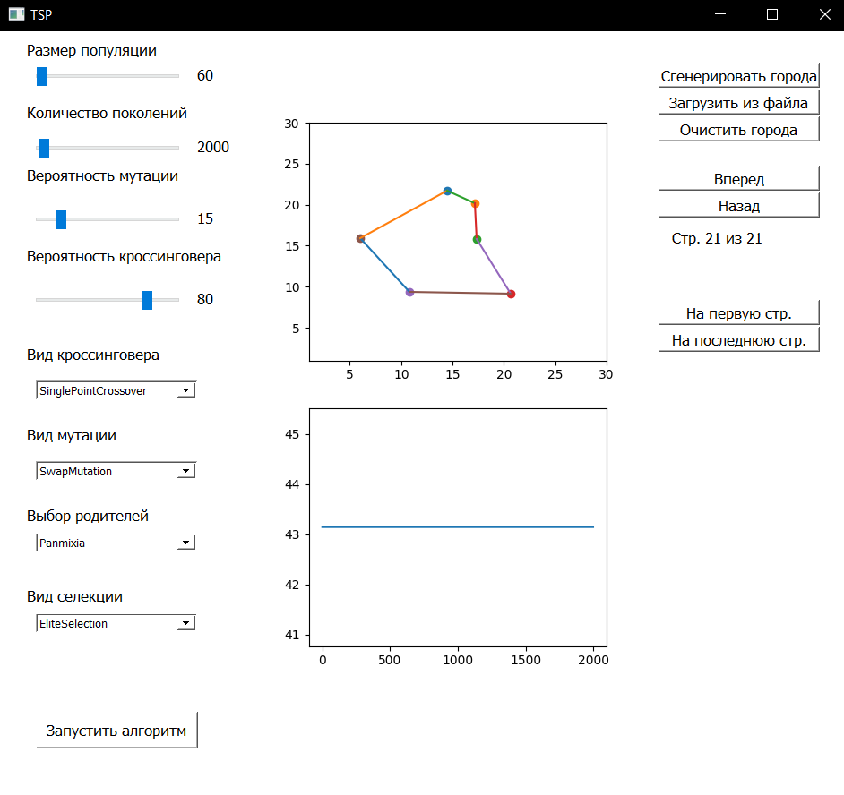

# Traveling Salesman Problem

## Задача

Задача коммивояжера (Traveling Salesman Problem, TSP) - это классическая задача оптимизации маршрута, которая заключается в поиске самого короткого замкнутого маршрута, проходящего через заданный набор городов, причем каждый город должен быть посещен ровно один раз.

## Запуск проекта

Проект запускается из директории src файла main

## Решение задачи

Для решения задачи используется генетический алгоритм. Генетические алгоритмы - это эволюционные методы оптимизации, вдохновленные принципами естественного отбора и генетики.

### Описание алгоритма

#### Основные компоненты

1. **Генерация популяции**: Используется стратегия "дробовика" для создания случайных подмножеств решений, позволяя алгоритму исследовать различные области поиска.

2. **Функция приспособленности (целевая функция)**: Оценивает длину пути для каждого набора хромосом с использованием матрицы смежности.

3. **Селекция в популяцию**:
   - **Аутбридинг на основе генотипа**: Выбор первой особи случайным образом, а второй - наименее похожей.
   - **Элитная селекция**: Лучшие особи передаются непосредственно в следующее поколение, с ограниченным количеством элитных особей.
   - **Рандомная селекция**: Все особи выбираются случайным образом.

4. **Выбор родителей**:
   - **Панмиксия**: Случайный выбор родителей, что способствует обнаружению редких, но оптимальных комбинаций генов.
   - **Метод рулетки**: Отбор пропорциональной приспособленности для сохранения "хороших" генов и шанса менее приспособленным особям.
   - **Турнирная селекция**: Выбор наиболее приспособленной особи из случайно выбранного набора особей.

5. **Кроссинговер (скрещивание)**:
   - **Двухточечное скрещивание**: Обмен фрагментами генетической информации между родителями.
   - **Одноточечное скрещивание**: Частный случай двухточечного, где происходит обмен фрагментами от одной точки.
   - **Равномерный кроссовер**: Каждый ген в потомке выбирается случайным образом от одного из родителей.

6. **Мутация**:
   - **Мутация обменом**: Обмен случайно выбранных генов.
   - **Мутация обращением**: Инверсия непрерывной последовательности генов.
   - **Равномерная мутация**: Каждая позиция в особи имеет небольшую вероятность быть измененной.

#### Параметры алгоритма

- **Вероятность кроссинговера**: Рекомендуется выбирать между 0.8 и 0.95 для лучшей сходимости.
- **Вероятность мутации**: Рекомендуется выбирать между 0.05 и 0.1 для лучшей сходимости.

### Скрещивание (Crossover)

#### Двухточечное скрещивание (Two-Point Crossover)

В нашей реализации используется двухточечное скрещивание (упорядоченное скрещивание). Идея заключается в том, чтобы выполнить обмен фрагментами генетической информации между родителями, не допуская дублирования чисел.

**Пример:**

```plaintext
хромосома 1 – 172|436|5
хромосома 2 – 213|765|4
->
5хромосома 1 – |765|
хромосома 2 – |436|
```

#### Одноточечное скрещивание (Single Point Crossover)

Мы также реализовали одноточечное скрещивание, которое является частным случаем двухточечного. В этом случае, происходит обмен фрагментами от одной точки.

**Пример:**

```plaintext
хромосома 1 – 172|4365
хромосома 2 – 213|7654
->
хромосома 1 – |7654
хромосома 2 – |4365
```

#### Равномерный кроссовер (Uniform Crossover)

В равномерном кроссовере каждый ген в потомке выбирается случайным образом от одного из родителей. Если в потомке не найдены все гены, оставшиеся значения заполняются вершинами из списка, которые еще не встречаются.

### Мутация (Mutation)

#### Мутация обменом (Swap Mutation)

Мутация обменом происходит путем обмена случайно выбранных генов в хромосоме.

**Пример:**

```plaintext
1235647 -> 1635247
```

#### Мутация обращением (Scramble Mutation)

Мутация обращением выбирает случайную последовательность генов и записывает их в обратном порядке или в случайном порядке.

**Пример:**

```plaintext
1234567 -> 1254367
1234567 -> 1243567
```

#### Равномерная мутация (Uniform Mutation)

Равномерная мутация изменяет каждую позицию в хромосоме с небольшой вероятностью (например, 0.4).

## Примечание

Для задачи коммивояжера каждый потомок всегда должен содержать путь по всем вершинам, и потеря этой информации считается недопустимой. Поэтому выбрано упорядоченное скрещивание хромосом родителей для обеспечения сохранения полного пути в каждом потомке.

### Архитектурные решения

#### Паттерн проектирования Strategy

Для переключения между конкретными операторами генетического алгоритма использован паттерн проектирования Strategy. Это позволяет фиксировать конкретные операторы при работе с алгоритмом и избегать одновременного использования нескольких операторов одного типа. Каждый оператор наследуется от интерфейса, определенного для своего типа. Класс `OperatorContext` обеспечивает выбор и переключение конкретного оператора.

#### Классы для хранения данных

Для удобства хранения данных введены следующие классы:

1. **Population (`Population`):** Хранит информацию о популяции в виде словаря, где каждый ключ - особь (картеж целых чисел, представляющих гамильтонов цикл), а значение - приспособленность особи (длина гамильтонова цикла). Класс также хранит матрицу смежности графа, границы алгоритма (максимальный размер популяции, число поколений).

2. **Caretaker (`Caretaker`):** Сохраняет каждое поколение популяции и обрабатывает всю историю для последующей обработки графическим интерфейсом.

3. **Logger (`Logger`):** Логгирует каждый период мутации и скрещивания, хранит информацию в списке и способен передавать данные в другие источники.

4. **Rates (`Rates`):** Датакласс для хранения вероятностей мутации и скрещивания.

#### Верхний уровень иерархии

Класс `TSP` отображает работу генетического алгоритма. Он запускает алгоритм и возвращает список всех популяций, полученных на каждой итерации.

#### Класс `Mediator`

Верхним уровнем иерархии проекта является класс `Mediator`. Он запускает работу класса `GUI`, который передает гиперпараметры, заданные пользователем, и информацию о вершинах через класс `Adapter`. Данные обрабатываются в матрицу смежности и передаются на вход классу `TSP`. Результаты работы передаются обратно в `GUI` для отрисовки.

### Графический интерфейс пользователя (GUI) для генетического алгоритма коммивояжера

GUI разработан с использованием библиотеки PyQt5 и matplotlib. Возможности GUI включают:

- Слайдеры для выбора параметров с обновляемыми значениями.
- Выпадающие меню для выбора вида мутации, селекции, кроссинговера и выбора родителей.
- Графики для отображения городов и изменения функции приспособленности.
- Кнопки для добавления городов (вручную, из файла, случайно), запуска алгоритма, и управления итерациями.
- Возможность листать итерации пошагово и переходить на первую/последнюю страницу после выполнения алгоритма.

Для создания GUI использована библиотека PyQt5 для интерфейса и matplotlib для отрисовки графиков. Объекты GUI и алгоритма взаимодействуют через класс Mediator, который передает результаты алгоритма для отображения в GUI.

## UML-диаграмма классов

Очень рекомендую тут вместо блядской pngшки использовать mermaid


## Примеры работы программы

1. Базовый пример с 6 городами



2. Пример с 15 случайно расположенными городами, первая страница


3. Пример с 20 городами, расположенными по окружности, первая страница


4. Пример с 20 городами, расположенными по окружности, последняя страница


## Используемые технологии

- random
- dataclasses
- math
- typing
- PyQt5
- numpy
- matplotlib

## Литература

1. [Методичка ГА](https://drive.google.com/file/d/1a36ozclBW4rJX4lwZMe9fWuuFeoE4fii/view)
2. [Статья ГА](https://proproprogs.ru/ga/ga-obzor-metodov-otbora-skreshchivaniya-i-mutacii)
3. [Статья на Wiki](https://ru.wikipedia.org/wiki/Gen_alg)
4. [Статья на НОУ ИНТУИТ](https://intuit.ru/studies/courses/14227/1284/lecture/24172)
